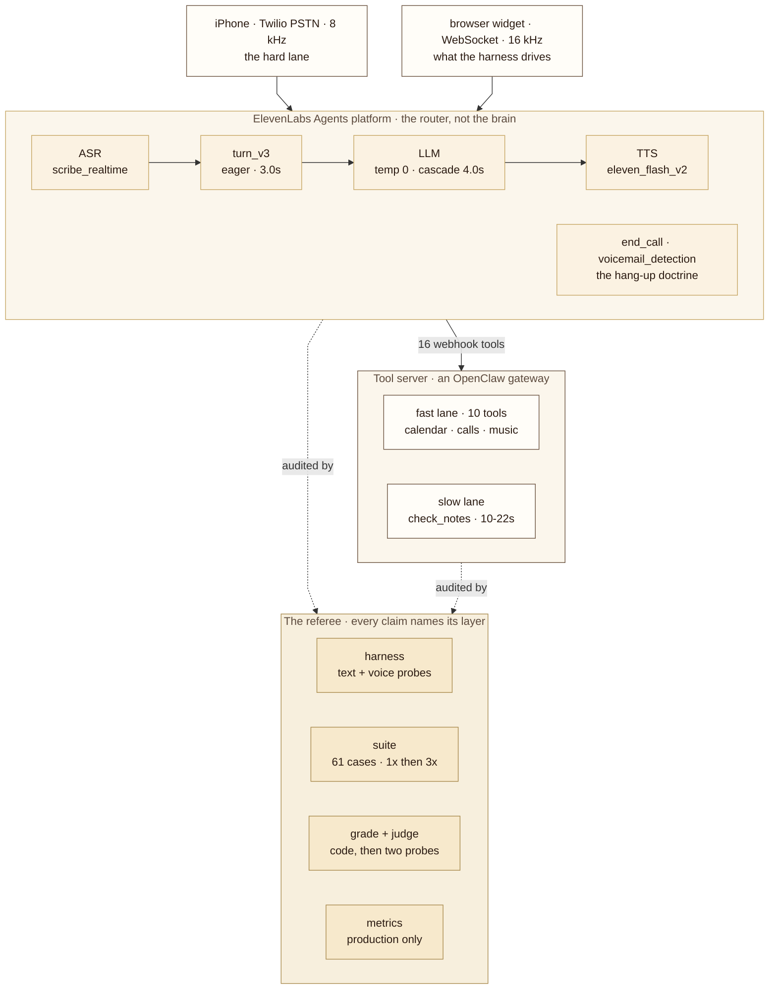

<div align="center">


<sub><em>A production voice agent stack: real-time speech-to-speech on the public phone network, with eval gates, latency SLOs, pinned failover routing, and live observability.</em></sub>

<br><br>

[](https://github.com/jameswniu/realtime-voice-agent-turn-taking-stack/actions/workflows/ci.yml)
[](#the-release-gate)
[](#the-release-gate)
[](#tier-2-judgepy)
[](#cost-engineering)
[](LICENSE)

<br>

<code>ring -> the agent picks up -> it is handled</code>

</div>

This repository is the production skeleton of a real-time speech-to-speech agent that answers a public phone number: the agent configuration, the probe harness that drives it like a caller, the eval suite that gates every behavior change, and the observability that watches it after it ships. The reference deployment (a phone companion persona called AJ) runs on the ElevenLabs Agents platform behind two transports, Twilio PSTN at 8 kHz (the hard lane) and WebSocket at 16 kHz, with 16 webhook tools against one tool server. ASR is scribe_realtime, turn-taking is turn_v3 (eager, 3.0s), the agent LLM runs at temperature 0 with a 4.0s fallback cascade, and TTS is eleven_flash_v2.

## The 90 second tour

- **Hear it:** [a real call on the hard 8 kHz phone lane](#hear-it-work), the agent answering live.
- **Read it:** [a production postmortem](#incidents), symptom to root cause to regression guard.
- **Run it:** the release gate, free, in one command: `python3 evals/suite.py --dry-run`; [the same gate runs in CI](https://github.com/jameswniu/realtime-voice-agent-turn-taking-stack/actions/workflows/ci.yml).

## Service level objectives

Targets are the thresholds the production dashboard alarms on. Current values come from the latest production window: 39 calls over 3 days, synthetic harness traffic excluded, computed by `evals/metrics.py` from the platform's own conversation history.

| SLO | target | current | how measured |
|---|---|---|---|
| answer latency p95 | under 12s | 10.8s | from end of caller speech to first agent audio, production calls only |
| tool latency p95 | under 5s | 4.0s | webhook round trip per tool call |
| tool failure rate | under 2% | 1% of 81 lookups | failed tool calls over total, per window |
| clean close | 100% | 100% | calls ending via end_call or caller hangup, never socket drop or silence |
| dead-air | under 0.5 per call | 0.4 per call | silent gaps of 5s or more, counted per call |

Medians for context: answer latency 1.6s, tool latency 1.6s. The slowest tool, check_notes, fails 7% of its calls and carries its own deferral protocol; the SLO table names it rather than averaging it away.


## Architecture

The interactive version of this diagram lives at **[jameswniu.github.io/realtime-voice-agent-turn-taking-stack](https://jameswniu.github.io/realtime-voice-agent-turn-taking-stack/architecture.html)**, standalone, no dependencies, no build step.




Two transports land in one agent, and the difference between them is the whole testing story. The WebSocket lane is crisp 16 kHz and drivable from code; the PSTN lane is 8 kHz telephony audio where "next" and "thanks" become the same word. Cheap layers come back green while the real call fails, so the layers are explicit, and every claim names the layer it was proven on.

The agent itself is a router, not a brain: turn-taking, tool choice, and persona at temperature 0. Anything requiring real knowledge goes through `check_notes`, a consult service behind the tool server, measured 10-22s end to end, and the entire deferral protocol (holding lines, grace windows, never asking the caller to repeat) exists because of that latency.

### The code, in three pieces

```
agent/    agent-config.template.json   the full ElevenLabs agent config, templated
          system-prompt.template.txt   the behavioral rulebook (~24k chars)
harness/  talk-to-her.js               text probe: real agent, real tools, no audio
          talk-to-her-voice.js         voice probe: real TTS -> ASR -> VAD, real-time pacing
evals/    cases.py                     61 probes mined verbatim from live calls
          suite.py                     runner: checkpointed, majority, 1x-then-escalate
          grade.py                     tier 0/1: pure code, decides ~54 of 55
          judge.py                     tier 2: structural probe + vibes probe
          sync.py                      ports the same cases to ElevenLabs' native suite
          metrics.py                   production-call metrics, harness traffic excluded
docs/     architecture.html            the interactive diagram (GitHub Pages)
```

One suite definition, two runners: `suite.py` runs everything locally against the live agent; `sync.py` ports the identical cases to ElevenLabs' hosted testing so a branch can be gated before it ever reaches a caller. If those drifted apart, a local green would say nothing about a cloud green, so they load from the same table.

## Routing and failover

Cost/latency-aware routing with governance, not a vendor default:

- **Pinned fallback order.** The agent LLM runs at temperature 0 with a 4.0s fallback cascade, and the fallback order is pinned rather than the vendor default, so which model answers, at what latency and cost, is a reviewed decision.
- **The backup path is exercised, not theoretical.** In the latest window the backup brain fired in 11 of 64 conversations (17%), each occurrence counted on the dashboard.
- **Allowlist enforcement.** Every billed model is checked against an allowlist, so no unapproved model can bill. Rogue models this window: none.
- **Burn tracked against a pinned baseline.** LLM credit burn currently reads 1.82x the pinned baseline and is flagged on the dashboard; credits are watched daily, burn and days left.

## Observability

The suite gates changes; a live dashboard watches the shipped agent. Every production call feeds three panels, refreshed by cron with no human in the loop, and harness traffic is excluded so the instrument never grades itself. Metrics, alerting, and governance each get a panel.


| panel | what it watches | current reading |
|---|---|---|
| responsiveness + reliability | answer latency from end of caller speech, tool latency, dead-air 5s+, tool failure rate, clean-close rate | 1.6s answer (p95 10.8s), 1.6s tool (p95 4.0s), 1% tool fail of 81, 100% clean close |
| conversation + usage | friction (caller corrects the agent), interruptions, turns per call, call length, tool mix, volume | 0% friction, 0.5 interruptions/call, 9.1 turns, 43s avg, 39 calls/3 days, mix led by end_call 25, tell_joke 14, check_notes 13 |
| model governance | fallback order pinned (not the vendor default), how often the backup brain actually fired, models billed outside the allowlist, LLM credit burn vs the pinned baseline | backup fired 17% of convs, rogue models none, burn 1.82x flagged |

Alerting is unattended: a bridge watchdog every 30 minutes, a metrics sweep every 6 hours, and a daily model watch that checks credit burn and days left, every billed model against the allowlist, and goodbyes that did not hang up. Alerts page loudly; silence is never treated as evidence.

## Incidents

Three production incidents, written down because the fixes are the architecture.

### 1. Wrong-channel route

- **Symptom:** a live call asked "what important communication do I have" and the agent opened the wrong channel, reading the owner's own agent thread back to him.
- **Blast radius:** one call; an internal thread was read back instead of the asked-for channels.
- **Root cause:** channel scope lived in the prompt instead of the tool contract.
- **Fix:** scope moved into the tool descriptions and the server code, where the model cannot drift past it.
- **Regression guard:** a replay probe of the exact production utterance, plus receipt 01 on the [evidence page](https://jameswniu.github.io/realtime-voice-agent-turn-taking-stack/receipts.html).

### 2. The thanks hangup

- **Symptom:** down the 8 kHz line "next" and "thanks" are nearly the same word; a misheard "thanks" ended a whole call.
- **Blast radius:** the entire call, and the costs are asymmetric: a wrong "next" costs one joke, a wrong "thanks" costs the call.
- **Root cause:** the hang-up decision keyed on a word the phone lane cannot reliably distinguish from an acknowledgement.
- **Fix:** an absolute rule: an acknowledgement never hangs up; the call ends only on plain words of leaving, and the goodbye rides inside the end_call tool so saying it and hanging up cannot come apart.
- **Regression guard:** acknowledgement probes in the suite, plus receipts 02 and 03.

### 3. The instrument lied

- **Symptom:** three defects reported as agent failures.
- **Blast radius:** the measurement layer itself; every verdict from the affected probes was suspect until re-graded.
- **Root cause:** all three were harness bugs: a blind fixed turn timer, a deferral grace shorter than the tool it waited for, and a timeout that discarded its own evidence.
- **Fix:** a turn ends when the answer lands, and deferral grace is sized to measured tool latency.
- **Regression guard:** harness output is compared against the vendor's own recorded transcripts; when a measurement contradicts a documented fact, the checker is suspected first.

## Hear it work

Nine real phone calls, placed from the owner's own number in a synthesized clone of his voice, the agent answering live on an 8 kHz line. Press play. The agent's voice is a generated ElevenLabs voice, not a recording of a person; the engineering behind each call is dissected on the [technical receipts page](https://jameswniu.github.io/realtime-voice-agent-turn-taking-stack/receipts.html).

### Retrieval across channels

**The agent sweeps three channels** (email, iMessage, WhatsApp) for messages that need attention, and names the quiet channel instead of skipping it (real names and vendors silenced here).

https://github.com/user-attachments/assets/5ea98a04-8e44-4fd6-a152-a91547968a4a

**The agent reads the week from the calendar**, days and times included (the private event details are bleeped for this demo).

https://github.com/user-attachments/assets/4eecac73-dc7f-4693-b0c5-880c7b785bbb

**The agent schedules a callback**, confirms the time on the spot, and the suite verifies a cron entry landed.

https://github.com/user-attachments/assets/5c200a71-1dd6-4a67-a234-32c080950ed7

### Live data, one turn

**The agent offloads arithmetic to a tool**: a check split with tip, computed and spoken in one turn.

https://github.com/user-attachments/assets/e435adcf-416b-451c-bbfa-d6dbfd4a51b2

**The agent fetches a live weekend forecast**, real data, spoken naturally.

https://github.com/user-attachments/assets/17461d86-1879-4cef-b86a-743f2cf84ae6

**The agent returns drive, scooter, and walk times** from a single distance lookup.

https://github.com/user-attachments/assets/3653598c-8b4d-4ccf-a9b8-4b2aa22e8cea

### Conversation control

**The agent tells a fetched joke and holds the line**; an acknowledgement never hangs up, only plain words of leaving do.

https://github.com/user-attachments/assets/16259c5a-fcf3-439b-bdea-62b5b5738161

**The agent handles a social check-in with no tool call**, correctly routing to none.

https://github.com/user-attachments/assets/9e565599-2306-4732-8128-78f9f6205548

**The agent describes its own capabilities** when asked, in conversational terms.

https://github.com/user-attachments/assets/b2e0f854-945e-4449-8c27-fa29c3e07463


## The release gate

[](https://github.com/jameswniu/realtime-voice-agent-turn-taking-stack/actions/workflows/ci.yml)

Behavior changes ship only through the suite. Three claims frame it, each backed by something you can run or read:

1. **The interesting part of a voice agent is not the prompt, it is the referee.** The prompt here is one file. The machinery that catches the agent being wrong, mishears, premature hangups, dead-end replies, tools that fired but did nothing, is nine files, and every one of them exists because a real call failed in a specific way.
2. **A test can be wrong, and half of these were.** The probe comments keep the reversals on the record: R57 flipped twice before the transcript data settled it. When a green suite disagrees with a failing live call, the suite is what gets indicted.
3. **Production numbers must exclude the instrument.** The metrics module filters to calls placed through Twilio from the owner's own number, because without that filter, ~99% of "call quality" was the harness grading itself.

### The harness

**`talk-to-her.js`** opens a real conversation over the text WebSocket: real agent, real tools, no audio. Its one hard-earned rule: *a turn is over when the answer has landed, not when a clock says so.* The first version advanced on a blind 14-second timer, which made every latency identical (the harness was timing itself) and truncated slow tools *unevenly*, biasing any A/B in exactly the direction the A/B was trying to measure.

**`talk-to-her-voice.js`** speaks. Each phrase is rendered to PCM, streamed at real-time pace as microphone frames, with continuous silence between utterances so server-side VAD sees a live mic. It exists because the text harness structurally cannot catch a mishearing or a turn-taking fault, the class of bug that keeps surfacing on live calls. It prints what ASR *actually heard* next to what was said, and measures answer latency from end-of-speech, the way a human experiences it.

Both harnesses share the deferral rule: when the reply is a holding line ("let me have a squiz") and no tool has landed yet, the grace window extends, because the consult tool measured 22-23s on the voice path, and a harness that gives up at 20 reports an agent failure that is actually an instrument failure. Both files carry the same regex, kept in sync deliberately.

End to end, the hard lane is tested the way it runs: real PSTN calls placed by the harness from the owner's verified caller ID with a synthesized clone of the owner's voice, then a 61-case suite grades by code first, 1x with only the reds escalated to 3x.


### The gate, stage by stage

Latest full run of this exact tree: **61/61 pass** (2026-08-05, 1x with reds escalated to 3x). Two probes graded as instrument errors on the first attempt, the judge's codex lane refused to run outside a git repo, and passed on retest the same day after the one-line fix; both the bug and the fix are in the commit history, which is where this repo keeps its mistakes.

The PSTN lane keeps receipts too: **[a real 8 kHz call you can listen to](https://jameswniu.github.io/realtime-voice-agent-turn-taking-stack/receipts.html)**, turn-by-turn players with redacted audio, plus the [written transcript](evals/transcripts/2026-08-05-pstn-important-comms.md), replaying a production miss from that same morning word for word and showing the routing fix holding on the hard lane.

#### cases.py, 61 probes, mined not invented

Utterances come verbatim from live calls, disfluencies kept: *"Hey. Hey, um, what events do I have for the next three weeks on my calendar?"*, *"Uh, h- how long by car?"*. Each carries a hand-set expected tool, grading against what the agent *did* is useless when production data already shows real routing errors. READ probes are safe; WRITE probes really change the volume and really create playlists, and hide behind `--allow-actions`.

The comments are the changelog of being wrong. R48 expected no tool until it became clear that searching the inbox for a flight is the *correct* move. R57 asserted "second thanks hangs up," shipped, and cut off a real call the same night when the transcriber wrote "thanks" for "next" twice, so now the absolute rule stands, verified 5/5: thanks never ends a call, and the closers that cannot be confused with "next" carry the ending.

#### suite.py, the runner

- **Checkpointed after every test.** Written after this machine kernel-panicked mid-suite and a 22-of-56 run produced nothing. A crash now costs the one test in flight.
- **Majority across repeats.** All-must-pass goes red on day one over ordinary nondeterminism; a gate that reds on known-good behaviour gets muted, and a muted gate is the silent failure.
- **1x, then escalate the reds to 3x.** A probe still earns its verdict from three runs, so confidence matches a flat 3x sweep, but the ones that pass first time never pay for repeats. Never 2x: majority at two repeats is as strict as one, at twice the price.
- **Outcome probes.** Born from a live failure the suite scored green: the agent *said* it rescheduled a call, and nothing landed in cron. R58/R59 assert what exists afterwards, create real jobs at 23:58 so a failed cleanup leaves hours of margin, and delete only what they created.
- **Timeout evidence capture.** "Timed out" is a fact about the harness process, silent on whether the agent answered. The partial transcript is saved and parsed, because a reply in the partial output means the agent did its job and the instrument hung.

#### grade.py, tier 0/1

Pure code: no model, no credits, no nondeterminism. Business tools are graded; call-control tools are filtered so a legitimate goodbye never fails a no-tool test, and `!end_call` exists as an explicit assertion because that same filter once made a premature hangup invisible to every probe. It earned trust by replaying the vendor's stored corpus and diffing verdicts: agreement everywhere except the runs where their judge was demonstrably wrong (it overrode a written "only the tool call decides" condition, and narrated a joke that never existed in the transcript).

It also scans every reply for spoken scaffolding, a reply that opens with a bare "thought" means the model's reasoning reached the phone line. Seen once in production, rate ~1 in 10; the suite already collects every reply, so the detector rides for free and stays silent on clean runs.

#### tier 2: judge.py

Two probes asking two *different* questions, not two votes on one:

| probe | question | style |
|---|---|---|
| structural | did the reply satisfy the condition **as written**? | evidence-bound, must quote verbatim, fabricated quotes rejected |
| vibes | would this **annoy** a real caller? | the human ear, ignores the spec entirely |

Structural fail blocks. Structural pass + vibes fail = **FLAG**: technically correct, feels wrong, the most valuable signal the harness produces, and it usually means the *test* needs fixing, not the agent. The two probes run on different model families from each other and from the agent, so nobody grades their own family's output.

#### metrics.py, production only

Reads the ElevenLabs conversation history and computes the two-layer dashboard (latency p50/p95 split by tool use, tool-failure rate, dead-air, friction, barge-ins, clean-end rate). The filter is exact, not heuristic: placed through Twilio, far-end number is the owner's, both directions. Exclusions are *published beside the numbers*, because a filter that silently drops 99% of rows looks identical to a broken fetch. A call the owner ends by hanging up counts as clean, only abnormal socket drops, duration-cap hits, and dying of silence are failures.


## What measuring it taught

1. **Verify the instrument before the agent.** Three separate defects reported as agent failures were harness bugs: the blind turn timer, the too-short deferral grace, the timeout that discarded its own evidence. When a measurement contradicts a documented fact, suspect the checker first.
2. **Costs are asymmetric, so rules are absolute.** A misheard "next" costs one joke; a misheard "thanks" costs the call. Every conditional version of the hang-up rule measured worse than the absolute one, a rule that needs state the model does not reliably track is a rule that fails.
3. **Structural vs. vibes disagreement is signal, not noise.** A single judge silently resolves the conflict by inventing criteria. Two probes with different questions surface it as a FLAG, and the flag usually points at the test.
4. **The prompt is not always the lever.** Measured three ways on one defect: adding a clause made it worse, rewording made it worse, reordering changed nothing. What worked: removing a contradiction, or moving the decision into code (the tool description, the grader, the runner).
5. **Grade the decision *and* the outcome.** Every tool-choice probe passed while a scheduling bug shipped nothing to cron. If a tool claims a side effect, some probe must look at the world afterwards.

## The numbers

| what | value | how it is known |
|---|---|---|
| latest full run | 61/61 pass | measured 2026-08-05, 1x + reds escalated to 3x |
| probes shipped | 61 READ + 7 WRITE | `evals/cases.py`, counted by `--dry-run` |
| decided by pure code | ~54 of 55 | grader coverage over the suite |
| tier-2 judge involvement | ~9% of runs | measured across stored runs |
| text probe cost | 192 credits avg | measured, n=25 conversations |
| voice probe cost | ~242 credits | 9.7 credits/sec × ~25s, from account billing |
| credit price | $1.66 = 10,000 credits | the account's own top-up dialog |

## Cost engineering

A full 1x pass prints its own estimate before running: **~$1.97** at current definitions. The 1x-then-escalate design is a per-verdict cost decision: a probe that passes on its first run has bought its verdict, and only a red spends the extra runs it takes to confirm one. The escalation shape is the economics: a flat 3x sweep costs ~35,000 credits (~$5.82); 1x with only the reds escalated costs ~14,600 (~$2.42) for the same per-verdict confidence. The cost constants in `suite.py` are measured, and the comment above them records the time a made-up constant under-reported by 13x, never restore one.

## What ships here, and what does not

**Ships:** the agent config as a template, the system prompt with placeholders, both harnesses, the full eval suite, the architecture assets. Every hard-won behavioral rule, the hang-up doctrine, the deferral grammar, the acknowledgement handling, ships verbatim.

**Does not ship, by design:**

- **A voice.** `{{VOICE_ID}}` is any voice in your ElevenLabs account. The reference deployment's voice stays with its owner, and so should yours: probe with a clone of *your own* voice, because macOS `say` cannot catch an ASR mishearing of *you*.
- **Keys, numbers, or endpoints.** Everything account-shaped is an environment variable or a `{{PLACEHOLDER}}`, see `.env.example`.
- **The tool server's internals.** The agent config needs 15 URLs; the reference implementation answers them with an [OpenClaw](https://openclaw.ai) gateway plus thin shims, but anything that serves HTTP works. `get_weather` needs no server at all, it goes straight to open-meteo.
- **Anyone's personal data.** Probe utterances are real production speech with identifying details swapped for neutral stand-ins; the swaps preserve the routing shape (a name you cannot place is still the signal to look up, whoever the name is).

What a stranger needs to run it: an ElevenLabs account with an agents-platform agent, an API key, a voice, and optionally a Twilio number for the PSTN lane. Reading the suite costs nothing; every live probe is a real billed conversation.


## Running it

```bash
git clone https://github.com/jameswniu/realtime-voice-agent-turn-taking-stack && cd realtime-voice-agent-turn-taking-stack
cp .env.example .env            # fill in your ElevenLabs key + agent id
cd harness && npm install       # one dependency: ws

# free: list the suite, no calls, no cost
python3 evals/suite.py --dry-run

# paid: real conversations against your live agent
python3 evals/suite.py                    # 1x, reds escalate to 3x automatically
python3 evals/suite.py --only R32-R39     # just the acknowledgement probes
node harness/talk-to-her.js "what time is it right now?"
node harness/talk-to-her-voice.js "tell me a joke"   # real ASR, real VAD
```

Setting the agent up from scratch: create an agents-platform agent in ElevenLabs, paste `agent/system-prompt.template.txt` (placeholders filled) as the prompt, apply the settings from `agent/agent-config.template.json` (ASR/turn/TTS blocks matter most), point the 15 webhook tools at your own `{{TOOL_SERVER}}`, pick a voice, and, for the full experience, attach a Twilio number. The suite runs identically against any agent that carries the same tool names.

## Read next

- **[docs/architecture.html](https://jameswniu.github.io/realtime-voice-agent-turn-taking-stack/architecture.html)**, the interactive stack diagram; every row carries the doctrine behind it
- **[RUNBOOK.md](RUNBOOK.md)**, the operating runbook: symptoms and first checks, alerting cadences, and the restore path
- **`agent/system-prompt.template.txt`**, the rulebook itself; the sections on acknowledgements, jokes, and call-ending are where most of the failures lived
- **`evals/cases.py`**, read the comments top to bottom and you have the project's honest history

## Limitations

- The reference deployment is single tenant: one owner, one phone number.
- ASR, TTS, and turn-taking run inside a managed vendor platform, so those layers are tuned by configuration rather than replaceable code.
- The phone lane is bounded by 8 kHz telephony audio, so some acoustic confusions are physics; the design absorbs them with absolute rules instead of pretending better audio exists.
- Full suite sweeps cost real credits, so they are budgeted runs rather than continuous.
- The personalization layer (calendar, notes, contacts) ships as templates, because the reference data is one person's life.

## Roadmap

- A scripted PSTN probe lane: real 8 kHz calls are already placed and [kept as receipts](evals/transcripts/2026-08-05-pstn-important-comms.md); the missing piece is packaging that flow as a harness script
- A fixture-capture helper, so multi-turn cases replay recorded tool turns instead of reconstructions
- A minimal reference tool server, so the webhook side runs without an OpenClaw install

---

<sub>AGPL-3.0. The persona, the doctrine, and the mistakes are all part of the work, fork accordingly.</sub>
