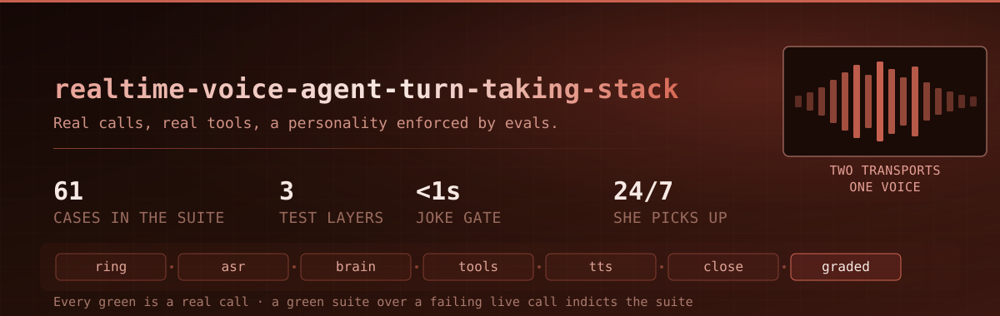
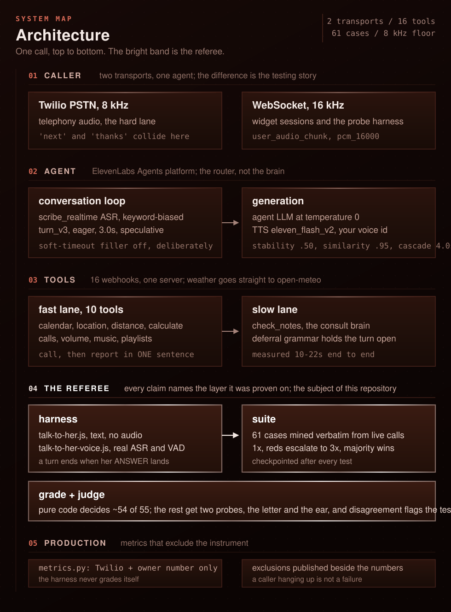
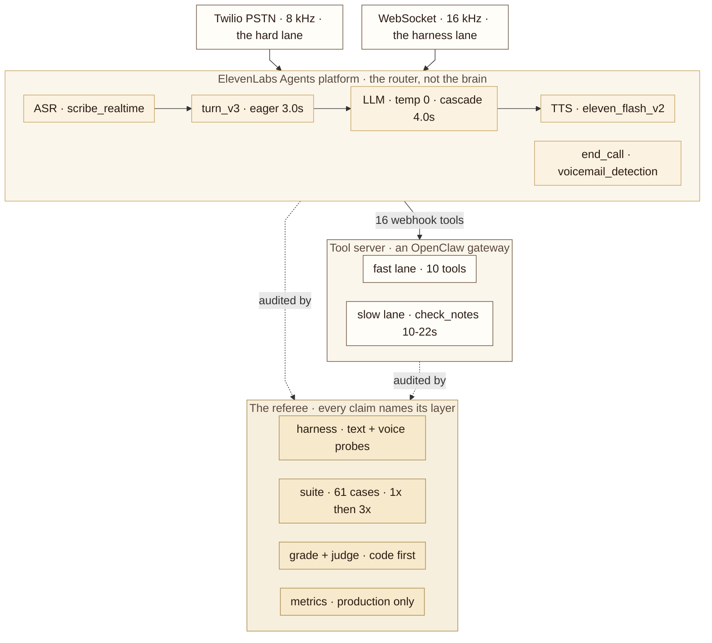

<div align="center">



<sub><em>A production voice agent stack behind a real phone number: eval gates, latency SLOs, pinned failover routing, live observability, and a personality worth calling.</em></sub>

<br><br>

[](https://github.com/jameswniu/realtime-voice-agent-turn-taking-stack/actions/workflows/ci.yml)
[](#the-release-gate)
[](#gradepy-tier-01)
[](#tier-2-judgepy)
[](#the-numbers)
[](LICENSE)

</div>

| Who it is for | The difference |
|:---|:---|
| Whoever used to do it by hand. One customer live, one number per agent, and [what changed for them](#who-calls-and-what-changed-for-them) | The prompt is one file. The referee that catches it being wrong is nine |
| **The flow** | **The benchmark** |
| `agent/` speaks, `harness/` calls it, `evals/` judges it. Nothing reaches a caller that the suite has not passed | Two SLOs breached over the lifetime, [both fixed](#service-level-objectives), 61/61 green |

- [**Hear a real call**](#hear-her-work), nine of them on the 8 kHz phone lane, press play
- [**Read a postmortem**](#incidents), three production failures, each fix held by a guard
- **Run the gate free**, `python3 evals/suite.py --dry-run`, the same check [CI runs](https://github.com/jameswniu/realtime-voice-agent-turn-taking-stack/actions/workflows/ci.yml)

**The interesting part is not the prompt, it is the referee.** Each of those nine files exists because a real call failed.

## The five hard problems in voice

A voice agent is not a chat model with a microphone. Five things are genuinely unsolved. This stack answers three, and the honest status of the other two is in the right column.

| | the problem | where this stack stands |
|---|---|---|
| 1 | **Turn-taking under interruption.** Knowing the caller stopped talking is the easy half. Holding a buffer when they change direction mid-sentence is not. | Partly. `turn_v3` eager at 3.0s, barge-ins counted at 0.5 per call, and deferral that extends its window instead of timing out. Direction-change mid-utterance is not handled. |
| 2 | **Irreversibility against annoyance.** Every confirmation costs patience. Every one you skip risks an act you cannot take back. | Answered. Costs are asymmetric, so the rule is absolute: an acknowledgement never ends a call, and the goodbye rides inside `end_call` so saying it and doing it cannot come apart. [The postmortem](#the-thanks-hangup). |
| 3 | **Persistent memory.** What the caller told you last week. | Not answered. `check_notes` retrieves within a call; nothing carries across them. |
| 4 | **Personalization of tone.** Sounding like someone this particular caller wants to talk to. | Half. A fixed persona at temperature 0, plus a vibes probe asking whether a reply would annoy a real caller. That grades tone; it does not adapt it. |
| 5 | **Two layers, one conversation.** The talking layer has to answer in under two seconds. The thinking layer takes as long as it takes. | Answered, and it is the shape of the whole system. The agent is a router at temperature 0; real knowledge goes to `check_notes`, measured at 10-22 seconds. |

**One and five are the same problem seen twice.** The brain takes 22 seconds and no caller will wait that long in silence, so the entire deferral apparatus, the holding lines and the grace windows and the rule against ever asking someone to repeat themselves, exists to cover that gap. Close the latency and half the turn-taking difficulty closes with it.

## Who calls, and what changed for them

One customer today, on their own number, with accounts kept apart, billing real calls since mid July. Read the rows as one person's day: the left is how it went before the line existed, the right is how it goes now. Ordered by what matters most.

| before | after |
|---|---|
| You opened three apps to find what actually needed a reply. | You ask once, and she names the quiet channel too. |
| You opened a laptop to see what the week looks like. | You hear the week back, days and times. |
| You pulled over to check how long the drive takes. | You ask while you keep driving. |
| You did the tip twice on a calculator at the table. | You hear the split, tip included, in one turn. |
| You typed a note with one thumb at a red light. | You say it once and it is filed by name. |
| You opened a tab for the forecast. | You get the weekend in a sentence. |
| You checked a fourth app in case something landed there. | Telegram gets swept with everything else. |
| You read a manual to find out what it can even do. | You ask, and she tells you in her own words. |
| You left the quiet alone, or hunted a joke on a screen. | She tells you one, and the line stays open. |
| You set an alarm the night before, and hoped. | The phone rings you, at the hour you asked. |

Most of the right column is a call you can [listen to below](#hear-her-work); the rest is a tool in the [config](#the-code-in-three-pieces).

## What holds when nobody is watching

The author is asleep and the caller has not called. That is the normal state, and it is the state the system has to be right in.

| runs unattended | cadence | what it catches |
|---|---|---|
| bridge watchdog | every 30 minutes | the line has stopped answering |
| metrics sweep | every 6 hours | latency, dead-air, and failure-rate drift |
| model watch | daily | credit burn, models billed outside the allowlist, goodbyes that did not hang up |
| release gate | every push | a change the 61-case suite cannot pass |

**Alerts page loudly, and silence is never treated as evidence.** Every call so far has closed cleanly, and the operating notes live in [RUNBOOK.md](RUNBOOK.md): symptom, first check, fix, and the restore path. The point of that file is that the next person does not have to ask me.

## Service level objectives

**Read the last two columns as before and after.** Lifetime breached two targets, tool latency and dead-air. The recent window clears both, and the [postmortems](#incidents) are why.

| SLO | target | lifetime | last 3 days | how measured |
|---|---|---|---|---|
| answer latency, p95 | under 12s | 10.6s (2.1s median) | 10.8s (1.6s median) | from end of caller speech to the reply, computed by `evals/metrics.py` over the conversation history, production calls only |
| tool latency, p95 | under 5s | **5.9s** | 4.0s (1.6s median) | webhook round trip per lookup; 333 lookups lifetime, 81 in the last 3 days |
| tool failure rate | under 2% | 3 of 333 (0.9%) | 1% of 81 | failed webhook lookups over total; the slowest tool is named rather than averaged away (check_notes) |
| clean close | 100% | 100% | 100% | a call ends through end_call or the caller hanging up; abnormal socket drops, duration-cap hits, and dying of silence count as failures |
| dead-air | under 0.5 per call | **1.1 per call** | 0.4 per call | silences of 5s or more, counted per production call |

These targets are the dashboard's alarm lines, not aspirations. Lifetime covers all 119 production calls since mid July; 1,007 synthetic harness conversations are excluded so the instrument never grades itself. The 3-day column is the rolling window at capture, 39 calls. Both captured 2026-08-07.

> [!TIP]
> **[Synthetic testing, at scale](https://jameswniu.github.io/realtime-voice-agent-turn-taking-stack/receipts.html)** opens ten cases turn by turn: a real production miss replayed and fixed, redaction machine-verified, every panel a routing decision under test.

## Hear her work

<sub><em>AJ is a designed persona; her voice is a generated ElevenLabs voice, and the caller is a synthesized clone of the owner's. Neither is a recording of a person.</em></sub>

### Stays on top of your day

**Sweeps what actually needs you** across email, iMessage, and WhatsApp, and names the quiet channel instead of skipping it.

https://github.com/user-attachments/assets/5ea98a04-8e44-4fd6-a152-a91547968a4a

**Reads back your week** from the calendar, with days and times.

https://github.com/user-attachments/assets/4eecac73-dc7f-4693-b0c5-880c7b785bbb

**Wakes you with a real call**, scheduled on the spot and confirmed back to you.

https://github.com/user-attachments/assets/5c200a71-1dd6-4a67-a234-32c080950ed7

### Answers on the spot

**Splits the check** with tip, out loud, in one turn.

https://github.com/user-attachments/assets/e435adcf-416b-451c-bbfa-d6dbfd4a51b2

**Gives you the weekend weather**, real forecast, spoken like a person.

https://github.com/user-attachments/assets/17461d86-1879-4cef-b86a-743f2cf84ae6

**Tells you how far and how to get there**, drive, scooter, and walk times in one answer.

https://github.com/user-attachments/assets/3653598c-8b4d-4ccf-a9b8-4b2aa22e8cea

### Keeps you company

**Tells a joke, and keeps the line open.** A "thanks" never hangs up; only a real close does.

https://github.com/user-attachments/assets/16259c5a-fcf3-439b-bdea-62b5b5738161

**Checks in warmly**, no tool, no script.

https://github.com/user-attachments/assets/9e565599-2306-4732-8128-78f9f6205548

**Tells you what she can do**, in her own words.

https://github.com/user-attachments/assets/b2e0f854-945e-4449-8c27-fa29c3e07463


## Architecture





**Two transports, and the difference between them is the whole testing story.**

| | WebSocket | Twilio PSTN |
|---|---|---|
| audio | 16 kHz, crisp | 8 kHz, telephony |
| cost per run | cheap | a real billed call |
| what it hides | every acoustic failure | nothing |
| the tell | "next" and "thanks" stay distinct | "next" and "thanks" collide |

Cheap layers come back green while the real call fails, so every claim on this page names the layer it was proven on.

The agent is a router, not a brain: turn-taking, tool choice, and personality at temperature 0. Real knowledge goes through `check_notes`, a consult brain measured at 10-22s end to end. The entire deferral apparatus, holding lines and grace windows and never asking the caller to repeat, exists because of that latency.

Interactive version: **[jameswniu.github.io/realtime-voice-agent-turn-taking-stack](https://jameswniu.github.io/realtime-voice-agent-turn-taking-stack/architecture.html)**, no dependencies, no build step.

### The code, in three pieces

```
agent/    agent-config.template.json   the full ElevenLabs agent config, templated
          system-prompt.template.txt   the behavioral rulebook (~24k chars)
harness/  talk-to-her.js               text probe: real agent, real tools, no audio
          talk-to-her-voice.js         voice probe: real TTS -> ASR -> VAD, real-time pacing
evals/    cases.py                     61 probes mined verbatim from live calls
          suite.py                     runner: checkpointed, majority, 1x-then-escalate
          grade.py                     tier 0/1: pure code, decides ~54 of 55
          judge.py                     tier 2: structural probe + vibes probe
          sync.py                      ports the same cases to ElevenLabs' native suite
          metrics.py                   production-call metrics, harness traffic excluded
docs/     architecture.html            the interactive diagram (GitHub Pages)
          receipts.html                turn-by-turn call receipts from the PSTN lane
```

One suite definition, two runners. `suite.py` runs locally against the live agent; `sync.py` ports the identical cases to ElevenLabs' hosted testing, so a branch is gated before it reaches a caller. They load from the same table, because otherwise a local green would say nothing about a cloud green.

## Routing and failover

Routing across models is cost and latency aware, with governance wrapped around it:

| control | what it does | current reading |
|---|---|---|
| pinned failover order | a 4.0s fallback cascade, pinned rather than vendor default, so which model takes a stalled turn is a deliberate decision | pinned |
| failover exercised | the backup brain is a live path, not a config line, so its behavior is known rather than assumed | fired in 11 of 64 conversations, 17% |
| allowlist on billing | every billed model is checked against an allowlist | rogue models: none |
| burn vs baseline | credit burn tracked against a pinned baseline, so cost drift pages instead of accumulating quietly | 1.82x, flagged |

The slow consult tool, `check_notes`, gets a deferral protocol rather than a timeout: holding lines and grace windows sized to measured latency, so a slow answer arrives late instead of never.

## Observability


| panel | what it watches | current reading |
|---|---|---|
| responsiveness + reliability | answer latency from end of caller speech, tool latency, dead-air 5s+, tool failure rate, clean-close rate | 1.6s answer (p95 10.8s), 1% tool fail of 81, 100% clean close |
| conversation + usage | friction (the caller correcting the agent), interruptions, turns per call, call length, tool mix, volume | 0% friction, 0.5 interruptions/call, 9.1 turns, 43s avg, 39 calls/3 days |
| model governance | fallback order pinned, how often the backup brain fired, models billed outside the allowlist, credit burn vs baseline | backup fired 17% of convs, rogue models none, burn 1.82x flagged |

The three cron watchdogs that keep this honest while nobody is looking are listed under [what holds when nobody is watching](#what-holds-when-nobody-is-watching). Snapshot is the rolling 3-day window at 2026-08-07; operations live in [RUNBOOK.md](RUNBOOK.md).

## Incidents

Three production failures, kept as postmortems. Each changed the system, and each fix is held by a guard that replays the failure.

### Wrong-channel route

- **Symptom:** a live call asked "what important communication do I have" and the agent opened the wrong channel, reading the owner's own agent thread back to him.
- **Blast radius:** one production call, and every future call with that phrasing until fixed.
- **Root cause:** channel scope lived in the prompt instead of the tool contract.
- **Fix:** scope moved into the tool descriptions and the server code, where routing reads it on every call.
- **Guard:** a replay probe of the exact production utterance, plus [receipt 01](https://jameswniu.github.io/realtime-voice-agent-turn-taking-stack/receipts.html#route-fix) showing the route holding on the 8 kHz lane.

### The thanks hangup

- **Symptom:** down the 8 kHz line "next" and "thanks" are nearly the same word, and a misheard "thanks" ended a whole call.
- **Blast radius:** the entire call, cut off mid-conversation. The costs are asymmetric: a wrong "next" costs one joke, a wrong "thanks" costs the call.
- **Root cause:** a conditional hang-up rule gave an acknowledgement call-ending authority, on a lane where ASR cannot reliably tell the two words apart.
- **Fix:** an absolute rule. An acknowledgement never hangs up; only plain words of leaving end the call, and the goodbye rides inside the end_call tool so saying it and hanging up cannot come apart.
- **Guard:** acknowledgement probes, plus [receipt 02](https://jameswniu.github.io/realtime-voice-agent-turn-taking-stack/receipts.html#thanks-trap) and [receipt 03](https://jameswniu.github.io/realtime-voice-agent-turn-taking-stack/receipts.html#clean-close), the trap sprung and the clean close, both on the hard lane.

### The instrument lied

- **Symptom:** three defects reported as agent failures, none of which the agent had committed.
- **Blast radius:** every verdict the harness issued in that state. A blind timer made all latencies read identical and truncated slow tools unevenly, biasing any A/B in the direction being measured.
- **Root cause:** all three were harness bugs: a blind fixed turn timer, a deferral grace shorter than the tool it waited for, and a timeout that discarded its own evidence.
- **Fix:** a turn ends when the answer lands, not when a clock says so, and deferral grace is sized to measured tool latency.
- **Guard:** harness output is compared against the vendor's recorded transcripts. When a measurement contradicts a documented fact, the checker is suspected first.

## The release gate

Behavior changes ship only through the suite. A change to the prompt, the config, or a tool contract has no direct path to callers. It earns its deploy by passing 61 cases against the live agent, graded by code first and models last. **Latest full run of this exact tree: 61/61 pass** (2026-08-05, 1x with reds escalated to 3x). Two probes graded as instrument errors on the first attempt (the judge's codex lane refused to run outside a git repo) and passed on retest the same day. Both the bug and the fix are in the commit history, which is where this repo keeps its mistakes.

Three working principles, each earned by a specific failure:

1. **The referee is the product.** One prompt file against nine files of machinery: mishears, premature hangups, dead-end replies, tools that fired but did nothing. Every one of the nine traces to a call that failed.
2. **A test can be wrong, and half of these were.** The probe comments keep the reversals on the record: R57 flipped twice before transcript data settled it. When a green suite disagrees with a failing live call, the suite gets indicted.
3. **Production numbers must exclude the instrument.** The metrics module filters to calls placed through Twilio from the owner's own number. Without that filter, ~99% of "call quality" was the harness grading itself.

The gate reaches the real lane. End-to-end tests are real PSTN calls, placed by the harness from a verified caller ID with a synthesized clone of the owner's voice, so what gets graded is what a caller hears. **[Listen to a real 8 kHz call](https://jameswniu.github.io/realtime-voice-agent-turn-taking-stack/receipts.html)**, turn by turn with redacted audio, plus the [written transcript](evals/transcripts/2026-08-05-pstn-important-comms.md).


### The harness

| | `talk-to-her.js` | `talk-to-her-voice.js` |
|---|---|---|
| drives | text WebSocket: real agent, real tools, no audio | real TTS to ASR to VAD, streamed at speaking pace |
| catches | routing, tool choice, deferral | mishearings, turn-taking, barge-in |
| cannot catch | anything acoustic, structurally | it is the expensive one, so it runs less often |
| measures latency from | end of caller text | end of speech, the way a human hears it |
| prints | what the agent did | what ASR actually heard, beside what was said |

**A turn is over when the answer has landed, not when a clock says so.** The first version advanced on a blind 14-second timer. That made every latency read identical and truncated slow tools *unevenly*, biasing any A/B toward whatever it measured.

Both share the deferral rule: a holding line with no tool landed extends the grace window. The consult tool measured 22-23s on the voice path, so a harness giving up at 20 reports an instrument failure as an agent failure.


### The suite, stage by stage

| file | job | how it decides |
|---|---|---|
| `cases.py` | 61 probes, mined verbatim from live calls | a hand-set expected tool per probe |
| `suite.py` | the runner | checkpointed, majority across repeats, 1x then escalate |
| `grade.py` | tier 0/1 | pure code, no model, decides ~54 of 55 |
| `judge.py` | tier 2 | two probes asking different questions, on different model families |
| `metrics.py` | the production dashboard | reads live calls, filters the harness out |

Every row below exists because of a specific failure.

#### cases.py, 61 probes, mined not invented

Utterances come verbatim from live calls, disfluencies kept: *"Hey. Hey, um, what events do I have for the next three weeks on my calendar?"*, *"Uh, h- how long by car?"*. Each carries a hand-set expected tool, because grading against what the agent *did* is useless when production data already shows real routing errors. READ probes are safe; WRITE probes really change the volume and really create playlists, and hide behind `--allow-actions`.

The comments are the changelog of being wrong. R48 expected no tool until it became clear that searching the inbox for a flight is the *correct* move. R57 asserted "second thanks hangs up," shipped, and cut off a real call the same night when the transcriber wrote "thanks" for "next" twice. Now the absolute rule stands, verified 5/5.

#### suite.py, the runner

- **Checkpointed after every test.** Written after this machine kernel-panicked mid-suite and a 22-of-56 run produced nothing. A crash now costs the one test in flight.
- **Majority across repeats.** All-must-pass goes red on day one over ordinary nondeterminism, and a gate that reds on known-good behaviour gets muted. A muted gate is the silent failure.
- **1x, then escalate the reds to 3x.** A doubtful probe still earns its verdict from three runs, so confidence matches a flat 3x sweep. Probes that pass first time never pay for repeats. Never 2x: majority at two repeats is as strict as one, at twice the price.
- **Outcome probes.** Born from a live failure the suite scored green: the agent said a call had been rescheduled, and nothing landed in cron. R58/R59 assert what exists afterwards, create real jobs at 23:58 so a failed cleanup leaves hours of margin, and delete only what they created.
- **Timeout evidence capture.** "Timed out" is a fact about the harness process, silent on whether the agent answered. The partial transcript is saved and parsed, because a reply in that output means the agent did its job and the instrument hung.

#### grade.py, tier 0/1

Pure code: no model, no credits, no nondeterminism. Business tools are graded; call-control tools are filtered so a legitimate goodbye never fails a no-tool test. `!end_call` exists as an explicit assertion because that filter once made a premature hangup invisible to every probe. It earned trust by replaying the vendor's stored corpus and diffing verdicts, agreeing everywhere except runs where their judge was demonstrably wrong.

It also scans every reply for spoken scaffolding. A reply opening with a bare "thought" means the model's reasoning reached the phone line. Seen once in production, rate ~1 in 10; the suite already collects every reply, so the detector rides for free.

#### tier 2: judge.py

Two probes asking two *different* questions, not two votes on one:

| probe | question | style |
|---|---|---|
| structural | did the reply satisfy the condition **as written**? | evidence-bound, must quote verbatim, fabricated quotes rejected |
| vibes | would this **annoy** a real caller? | the human ear, ignores the spec entirely |

Structural fail blocks. Structural pass plus vibes fail is a **FLAG**: technically correct, feels wrong, the most valuable signal the harness produces, and usually a sign the *test* needs fixing. The two probes run on different model families from each other and from the agent, so nobody grades their own family's output.

#### metrics.py, production only

Reads the conversation history and computes the two-layer dashboard: latency p50/p95 split by tool use, tool-failure rate, dead-air, friction, barge-ins, clean-end rate. The filter is exact, not heuristic: placed through Twilio, far-end number is the owner's, both directions. Exclusions are *published beside the numbers*, because a filter that silently drops 99% of rows looks identical to a broken fetch.


## What measuring it taught

1. **Verify the instrument before the agent.** Three defects reported as agent failures were harness bugs. When a measurement contradicts a documented fact, suspect the checker first.
2. **Costs are asymmetric, so rules are absolute.** A misheard "next" costs one joke; a misheard "thanks" costs the call. Every conditional version of the hang-up rule measured worse than the absolute one.
3. **Structural vs vibes disagreement is signal, not noise.** A single judge silently resolves the conflict by inventing criteria. Two probes with different questions surface it, and the flag usually points at the test.
4. **The prompt is not always the lever.** Measured three ways on one defect: adding a clause made it worse, rewording made it worse, reordering changed nothing. What worked: removing a contradiction, or moving the decision into code.
5. **Grade the decision *and* the outcome.** Every tool-choice probe passed while a scheduling bug shipped nothing to cron. If a tool claims a side effect, some probe must look at the world afterwards.

## The numbers

| what | value | how it is known |
|---|---|---|
| latest full run | 61/61 pass | measured 2026-08-05, 1x + reds escalated to 3x |
| probes shipped | 61 READ + 7 WRITE | `evals/cases.py`, counted by `--dry-run` |
| decided by pure code | ~54 of 55 | grader coverage over the suite |
| tier-2 judge involvement | ~9% of runs | measured across stored runs |
| text probe cost | 192 credits avg | measured, n=25 conversations |
| voice probe cost | ~242 credits | 9.7 credits/sec × ~25s, from account billing |
| credit price | $1.66 = 10,000 credits | the account's own top-up dialog |

**Cost engineering.** The 1x-then-escalate design is a per-verdict cost decision: repeat spend goes only to probes whose verdict is in doubt. A full 1x pass prints its own estimate before running, **~$1.97** at current definitions. A flat 3x sweep costs ~35,000 credits (~$5.82); 1x with only reds escalated costs ~14,600 (~$2.42) for the same per-verdict confidence. The cost constants in `suite.py` are measured, and the comment above them records the time a made-up constant under-reported by 13x.

## What ships here, and what does not

**Ships:** the agent config as a template, the system prompt with placeholders, both harnesses, the full eval suite, the architecture assets. Every hard-won behavioral rule ships verbatim: the hang-up doctrine, the deferral grammar, the acknowledgement handling.

**Does not ship, by design:**

- **A voice.** `{{VOICE_ID}}` is any voice in your ElevenLabs account. Probe with a clone of *your own* voice, because macOS `say` cannot catch an ASR mishearing of *you*.
- **Keys, numbers, or endpoints.** Everything account-shaped is an environment variable or a `{{PLACEHOLDER}}`. See `.env.example`.
- **The tool server's internals.** The config needs 15 URLs; the reference implementation answers them with an [OpenClaw](https://openclaw.ai) gateway plus thin shims, but anything serving HTTP works. `get_weather` needs no server at all.
- **Anyone's personal data.** Probe utterances are real production speech with identifying details swapped for neutral stand-ins that preserve the routing shape.

To run the agent you need an ElevenLabs account with an agents-platform agent, an API key, a voice, and optionally a Twilio number for the PSTN lane. Reading the suite costs nothing; every live probe is a real billed conversation.


## Running it

```bash
git clone https://github.com/jameswniu/realtime-voice-agent-turn-taking-stack && cd realtime-voice-agent-turn-taking-stack
cp .env.example .env            # fill in your ElevenLabs key + agent id
cd harness && npm install       # one dependency: ws

# free: list the suite, no calls, no cost (this is also what CI runs)
python3 evals/suite.py --dry-run

# paid: real conversations against your live agent
python3 evals/suite.py                    # 1x, reds escalate to 3x automatically
python3 evals/suite.py --only R32-R39     # just the acknowledgement probes
node harness/talk-to-her.js "what time is it right now?"
node harness/talk-to-her-voice.js "tell me a joke"   # real ASR, real VAD
```

Setting up from scratch, in order:

1. Create an agents-platform agent in ElevenLabs.
2. Paste `agent/system-prompt.template.txt` as the prompt.
3. Apply the settings from `agent/agent-config.template.json`. The ASR, turn, and TTS blocks matter most.
4. Point the 15 webhook tools at your own `{{TOOL_SERVER}}`.
5. Pick a voice, and attach a Twilio number for the full experience.

The suite runs identically against any agent carrying the same tool names.

## Read next

- **[RUNBOOK.md](RUNBOOK.md)**, the operating notes: symptom to first check to fix, what pages and when, and the restore path
- **[docs/architecture.html](https://jameswniu.github.io/realtime-voice-agent-turn-taking-stack/architecture.html)**, the interactive stack diagram; every row carries the doctrine behind it
- **`agent/system-prompt.template.txt`**, the rulebook; the sections on acknowledgements, jokes, and call-ending are where most failures lived
- **`evals/cases.py`**, read the comments top to bottom and you have the project's honest history

## Limitations

- **Single tenant per customer.** Each customer gets an isolated account and one number per agent. Multiple numbers per customer, split by department, are on the roadmap rather than shipped.
- **Managed vendor platform.** ASR, TTS, and turn-taking run inside a managed platform, so those layers are tuned by configuration rather than replaceable code.
- **8 kHz telephony.** The phone lane is bounded by 8 kHz audio, so some acoustic confusions are physics. The design absorbs them with absolute rules instead of pretending better audio exists.
- **Budgeted, not continuous.** Full suite sweeps cost real credits, so they are budgeted runs.
- **Templates, not one person's data.** The personalization layer ships as templates because the reference data is one person's life.

## Roadmap

- Per-department numbers inside one customer, so a finance line and a security line answer from separate rulebooks under separate auth. One number per agent already keeps a wrong answer inside one team; splitting further is what keeps each rulebook small enough to stay testable, since a single agent holding every department's rules is a prompt no suite can cover
- A scripted PSTN probe lane: real 8 kHz calls are already placed and [kept as receipts](evals/transcripts/2026-08-05-pstn-important-comms.md); the missing piece is packaging that flow as a harness script
- A fixture-capture helper, so multi-turn cases replay recorded tool turns instead of reconstructions
- A minimal reference tool server, so the webhook side runs without an OpenClaw install

---

<sub>AGPL-3.0. The persona, the doctrine, and the mistakes are all part of the work, fork accordingly.</sub>
